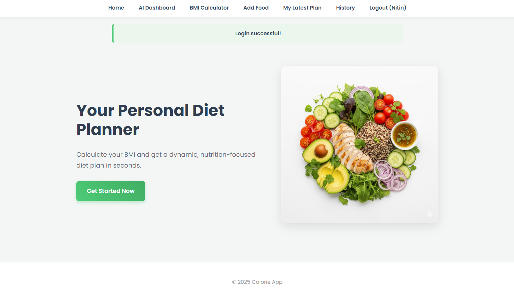
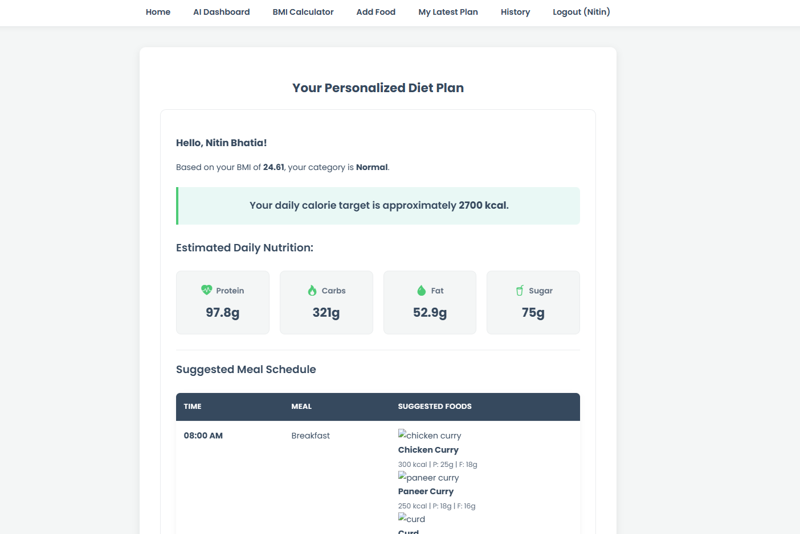
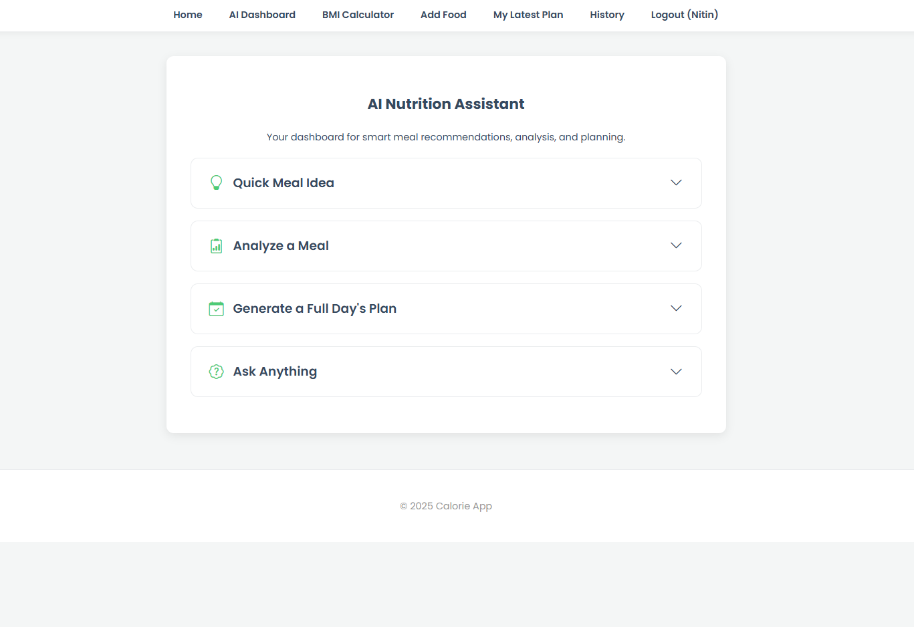

# 🥗 Calorie Tracker & AI Diet Planner


A dynamic web application built with Flask that provides users with a comprehensive suite of tools for diet and nutrition management.  
The app calculates **BMI**, generates **personalized diet plans**, and leverages the **Google Gemini API** for interactive nutritional advice.

---

## 📸 Screenshots

| Homepage | Diet Plan | AI Dashboard |
| :---: | :---: | :---: |
|  |  |  |

> 📝 Place your actual screenshots inside:  
> `static/images/screenshots/`  
> and replace these placeholder names.

---

## ✨ Key Features

- **👤 User Authentication** – Secure registration and login system.
- **🔢 BMI Calculator** – Calculates Body Mass Index.
- **📅 Personalized Diet Plans**  
  - Full-day meal plan based on BMI & goals.  
  - **Timed eating schedule**.  
  - Pictures + nutrition info (**calories, protein, fat**).  
- **📄 PDF Downloads** – Export diet plans as PDFs.  
- **📚 Custom Food Database** – Add your own food items for next diet plan.  
- **📈 User History** – Save past BMI & plans, with **Delete History** feature.  
- **🤖 Advanced AI Dashboard** – Powered by Google Gemini API:  
  1. Quick Meal Idea  
  2. Meal Analyzer  
  3. Full Day Plan Generator  
  4. Ask Anything Chatbot  

---

## 🛠️ Tech Stack

- **Backend**: Python, Flask, Flask-SQLAlchemy, Flask-Login  
- **Database**: SQLite  
- **Frontend**: HTML, CSS, Jinja2, JavaScript  
- **AI Integration**: Google Gemini API (`google-generativeai`)  
- **PDF Generation**: WeasyPrint  
- **Styling**: Bootstrap Icons  

---

## 📂 Project Structure

```text
calorie_app/
├── .env                  # Secret API keys (Gemini, etc.)
├── app.py                # Main Flask app entry point
├── extensions.py         # Shared extensions (SQLAlchemy, LoginManager)
├── models.py             # Database models
├── requirements.txt      # Python dependencies
│
├── instance/
│   └── calorie_app.db    # SQLite database (auto-generated)
│
├── routes/
│   ├── __init__.py
│   ├── ai_routes.py      # AI Dashboard (Gemini-powered features)
│   ├── auth_routes.py    # Login, Register, Logout
│   ├── bmi_routes.py     # BMI calculator logic
│   ├── diet_logic.py     # Core diet plan generation logic
│   ├── diet_routes.py    # Diet plan display, history, PDF downloads
│   └── food_routes.py    # Add custom foods
│
├── static/
│   ├── css/
│   │   └── style.css     # Custom styles
│   └── images/
│       ├── hero-image.jpg
│       └── foods/        # Food item images
│           ├── roti.jpg
│           └── ...
│
└── templates/
    ├── base.html
    ├── index.html
    ├── login.html
    ├── register.html
    ├── bmi.html
    ├── add_food.html
    ├── diet.html         # "My Latest Plan" page
    ├── diet_result.html
    ├── history.html
    ├── ai_dashboard.html
    └── plan_pdf.html     # PDF export template
```

# 🚀 Setup and Installation

### 1. Clone the Repository

```bash
git clone <your-repository-url>
cd calorie_app

```

---

### 2. Create & Activate a Virtual Environment

**Windows (PowerShell):**

```powershell
python -m venv venv
.\venv\Scripts\activate

```

**macOS / Linux:**

```bash
python3 -m venv venv
source venv/bin/activate

```

---

### 3. Install Dependencies

```bash
pip install -r requirements.txt

```

⚠️ Windows users: If WeasyPrint shows errors, install GTK for Windows.

---

### 4. Setup Environment Variables

Create a `.env` file in your project root and add:

```
GEMINI_API_KEY="your_secret_api_key_here"

```

---

# ▶️ How to Run

**Initialize the Database**

Windows (PowerShell):

```powershell
$env:FLASK_APP = "app.py"
flask init-db

```

macOS / Linux:

```bash
export FLASK_APP=app.py
flask init-db

```

✔️ Expected output:

```
Initialized the database successfully.

```

---

**Run the Application**

```bash
python app.py

```

App will run at 👉 [http://127.0.0.1:5000](http://127.0.0.1:5000/)

---

# 📦 Updating Requirements

```bash
pip freeze > requirements.txt

```


